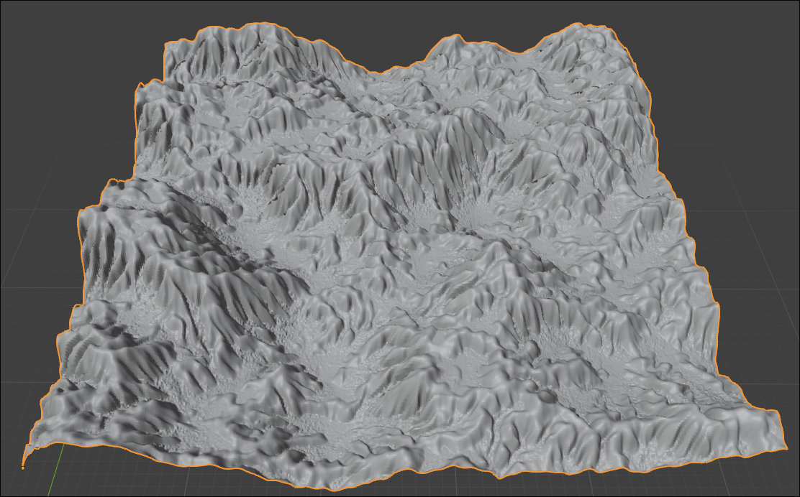

#### How to run:
```bash
edit Makefile to point the BLENDER variable to the blender executable

make repo // do this only once

make dev
```

#### Where to find the addon:
[addon web page](https://extensions.blender.org/add-ons/erosion-terrain-extension/)

#### Example images:



